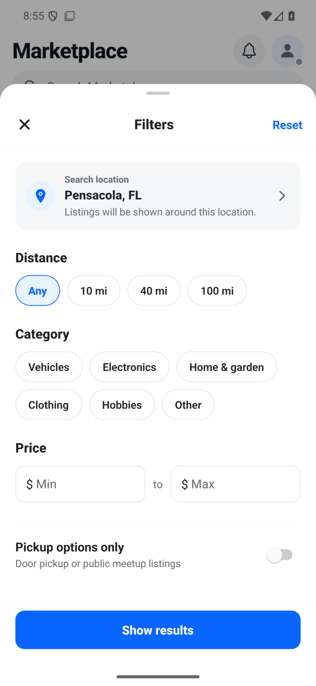
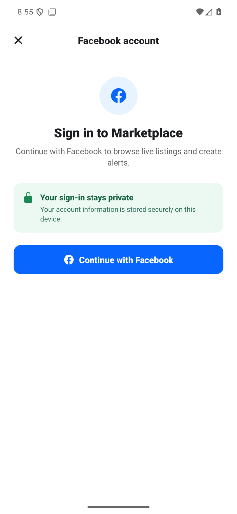
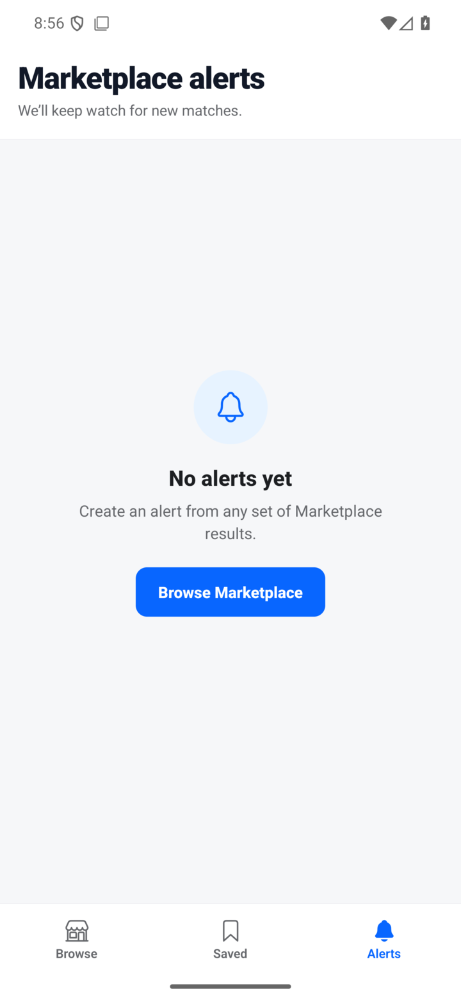

> [!NOTE]
> AI Slop

# Facebook Marketplace

I'm never installing the Facebook app on my phone again. Unfortunately, Marketplace is still the best place to buy used stuff locally.

<p align="center">
  
  
  
</p>

## What it does

- Browses and searches live Marketplace listings
- Filters by location, distance, category, price, and pickup options
- Saves listings locally
- Creates saved-search alerts and posts local notifications
- Keeps Facebook traffic and session data on the device

Marketplace messaging is not included.

## How it works

Sign-in opens Facebook inside the app. Credentials go directly to Facebook, and the resulting session cookies are stored with Expo SecureStore. Marketplace requests are sent directly from the device, with no project backend or proxy.

Logging out deletes the saved session and clears the in-app browser's cookies.

## Run it

You need Node.js, npm, Bun, an Android SDK, and either an emulator or Android device.

```sh
npm install
npm run android
```

For later development sessions:

```sh
npm start
```

Expo Go is not supported because the app uses native modules.

## Checks

```sh
npm run typecheck
npm test
npm run doctor
```

## Build an APK

```sh
npx expo prebuild --platform android --clean --no-install
NODE_ENV=production ./android/gradlew -p android :app:assembleRelease
```

The APK is written to `android/app/build/outputs/apk/release/app-release.apk`.

Pushing a semantic version tag builds a signed APK and publishes a GitHub release. See [RELEASING.md](RELEASING.md) for the one-time signing setup.

## Caveats

- Facebook can break this app whenever it changes its undocumented web interfaces.
- Background alerts run on Android's schedule and are not instant.
- Notifications come from this app, not from Facebook.
- Android is the only tested platform.
